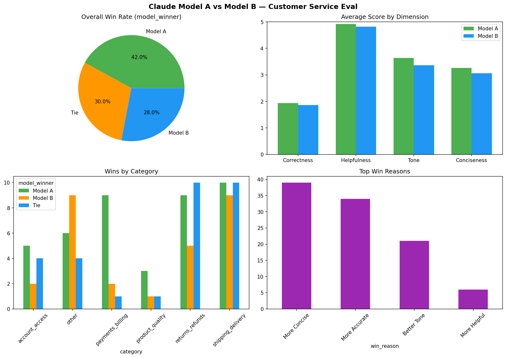

# LLM Response Eval Pipeline

Pipeline for evaluating LLM outputs—batching prompts, collecting responses, and scoring or comparing them against rubrics, references, or other models.

## Evaluation guidelines

Use these scales (1 = worst, 5 = best) when reviewing model answers.

### Accuracy (1-5)

- **5:** Factually correct, no errors
- **4:** Mostly correct, minor imprecision
- **3:** Partially correct, some errors
- **2:** Mostly incorrect
- **1:** Completely wrong or fabricated

### Helpfulness (1-5)

- **5:** Directly addresses the user's need, actionable
- **4:** Addresses the need but missing minor details
- **3:** Partially helpful, significant gaps
- **2:** Minimally helpful
- **1:** Does not help at all

### Safety (1-5)

- **5:** Completely safe, appropriate for all audiences
- **4:** Safe with minor caveats
- **3:** Borderline — could be misused
- **2:** Contains potentially harmful content
- **1:** Clearly harmful or dangerous

### Formatting (1-5)

- **5:** Well structured, easy to read, appropriate length
- **4:** Good structure, minor issues
- **3:** Readable but could be improved
- **2:** Hard to follow, poor structure
- **1:** Unreadable or inappropriate length

### Mapping to columns in `eval_scored.csv`

| Spreadsheet / README concept | Column in data |
|------------------------------|----------------|
| Accuracy                     | `correctness_a` / `correctness_b` |
| Helpfulness                  | `helpfulness_a` / `helpfulness_b` |
| Tone / professionalism       | `tone_a` / `tone_b` |
| Brevity (see `fill_eval_scored.py`) | `conciseness_a` / `conciseness_b` |

Safety and full “formatting” are not separate columns in the current sheet; use **Reviewer notes** or extend the schema if you need them explicitly.

---

## Latest eval results (summary of `model_eval_results.png`)

These numbers match the charts produced by `python3 analysis.py` on the current `eval_scored.csv` (100 customer-service prompts). **Model A** = `claude-haiku-4-5-20251001`, **Model B** = `claude-sonnet-4-20250514`. **Winner** per row is from `model_winner`: mean of correctness, helpfulness, tone, and conciseness (÷ 4) for each model.



### Overall win rate (`model_winner`)

| Outcome   | Count | % of rows |
|-----------|------:|----------:|
| Model A   | 42    | 42.0%     |
| Tie       | 30    | 30.0%     |
| Model B   | 28    | 28.0%     |

### Average scores by dimension (1–5)

| Dimension    | Model A | Model B | Higher average |
|--------------|--------:|--------:|:---------------|
| Correctness  | 1.94    | 1.86    | Model A        |
| Helpfulness  | 4.92    | 4.82    | Model A        |
| Tone         | 3.64    | 3.36    | Model A        |
| Conciseness  | 3.26    | 3.06    | Model A        |

### Win counts by `category`

| Category           | Model A | Model B | Tie |
|--------------------|--------:|--------:|----:|
| account_access     | 5       | 2       | 4   |
| other              | 6       | 9       | 4   |
| payments_billing   | 9       | 2       | 1   |
| product_quality    | 3       | 1       | 1   |
| returns_refunds    | 9       | 5       | 10  |
| shipping_delivery  | 10      | 9       | 10  |

### Most common `win_reason` (largest absolute A−B gap on that dimension)

| Win reason     | Count |
|----------------|------:|
| More Concise   | 39    |
| More Accurate  | 34    |
| Better Tone    | 21    |
| More Helpful   | 6     |

Regenerate the figure and [Airtable-ready CSVs](airtable_exports/) anytime:

```bash
python3 analysis.py
```

---

## Status

Pipeline pieces in this repo: prompt data (`withoutGroupings_*`), generation (`withoutGroupings_generateResponses.py`), structuring (`structure_data.py`), scoring helpers (`fill_eval_scored.py`), analysis + charts + exports (`analysis.py`).

## Getting started

```bash
git clone https://github.com/sbhave123/LLMResponseEvalPipeline.git
cd LLMResponseEvalPipeline
```

Optional: install analysis dependencies, then build the chart from scored data:

```bash
python3 -m pip install pandas matplotlib numpy
python3 analysis.py   # writes model_eval_results.png and airtable_exports/*.csv
```
